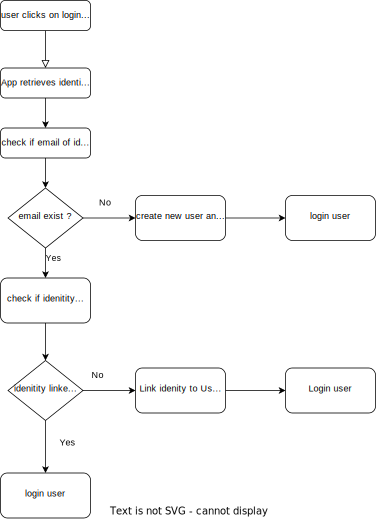

# Chainstep Social Logins Challenge

## Task
Create a lightweight social login (using passport, auth0, a library of your choice or hand-crafted). Implement >=3 login strategies (e.g. github, twitter, linkedin oauth) and allow users to combine data from a second and third login with their account data. Solve the following problem: If a user logs in with one social account, and later with a different social account, and then attempts to link the first account – what should happen and how do you solve this?


## Analysis & Solution

I llustrated the solution to the problem with the aid of the flowchart below:
### Flowchart

### Comments
I used the MD5 hash of the email as the unique identifier for the user in my email. So by "email exist" i mean does the MD5 email exist 


## How to run 
```
npm install
npm run start
```
## Environment

- node.js 16.13 +
- npm 6.x

## Technology

- **Typescript** is our programming language.
- **Express** is used as a web application framework
- **passport-github2** is the passport strategy for authenticating Github.
- **passport-google-oauth2** is the passport sategy for authenticating google.
- **passport-linkedin-oauth2** is the passport sategy for authenticating Linkedin.
- **cookie-session** is a middleware module the stores our data on the client side.
- **nodemon** is used to automatically restart the server when the change detected.
- **ejs** is a templating engine.
- **dotenv** load environmental variables.

